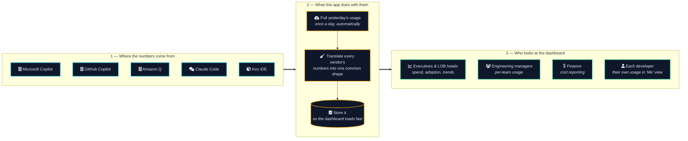
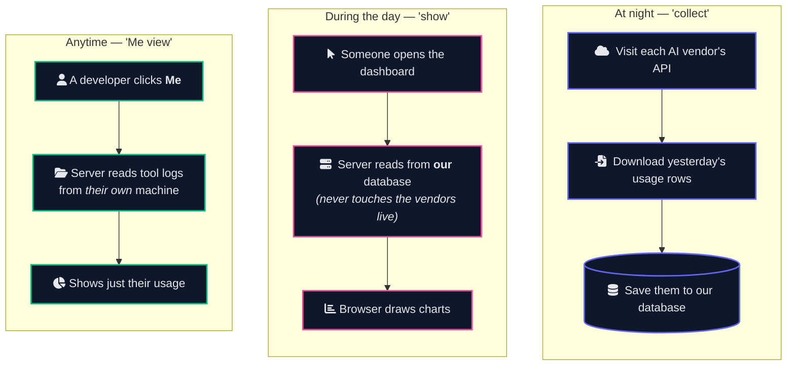
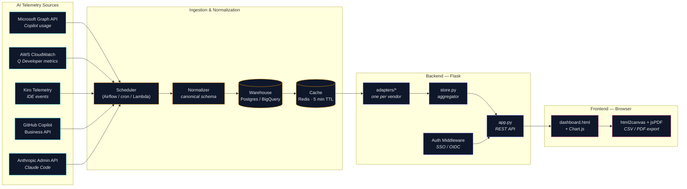
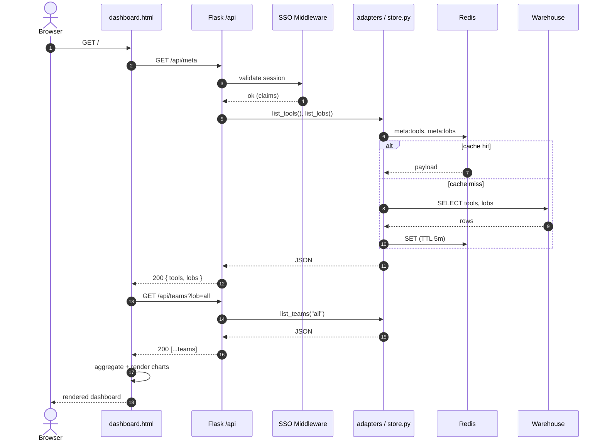
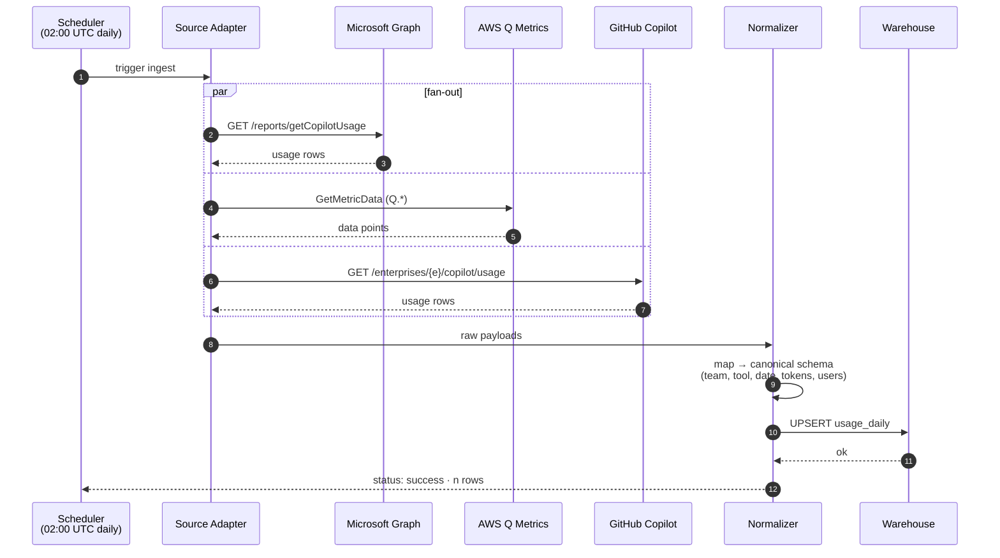
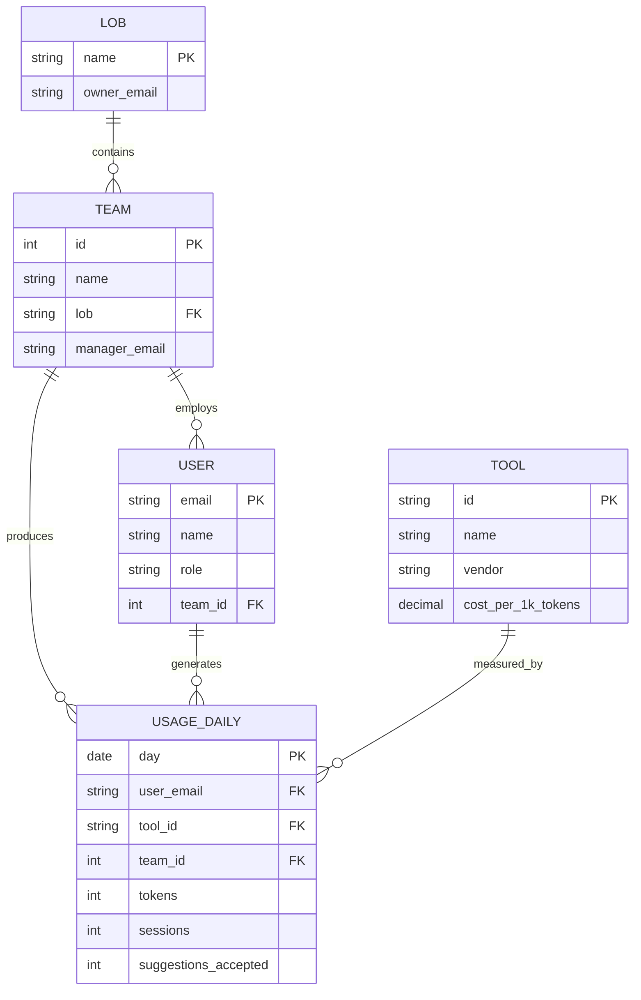
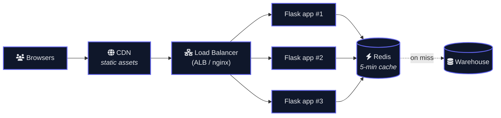

# Enterprise AI Adoption Dashboard — Architecture

> **Two ways to read this doc**
> - **Just want to understand it?** Read sections 1 and 2 — plain English with diagrams.
> - **Need to build, deploy, or extend it?** Sections 3+ have the engineering detail.

Diagrams use [Mermaid](https://mermaid.js.org/). They render natively on
GitHub, in VS Code with the *Markdown Preview Mermaid Support* extension,
or by pasting any block into <https://mermaid.live>.

---

## 1. What this thing does — the 60-second version

Your company is paying for several AI tools — Microsoft Copilot, GitHub
Copilot, Claude Code, Amazon Q, Kiro, others. Every team uses something
different, the bills add up, and nobody has a single answer to:

- **Who actually uses what?**
- **What is each tool costing us?**
- **Is anyone getting real value, or are licenses sitting idle?**

This dashboard collects usage from every tool, puts it in one place, and
draws the picture.

**A real-world analogy.** Think of it like a Fitbit dashboard — but for
your team's AI use. Each AI tool is a different sensor on a different
wrist; this app puts every reading on the same chart, in the same units,
so you can compare apples to apples.

---

## 2. How it actually works (still plain English)

Three small things happen, on three different schedules:

**Why split it into three?** Calling vendor APIs is slow (sometimes
minutes). A dashboard has to feel instant. So the slow work runs once
at night, and the browser only ever talks to our own fast database
during the day. The "Me" view is separate because it reads from your
own laptop — there's no enterprise system that knows what you ran in
your terminal at 11pm.

---

## 3. System overview — for engineers

---

## 4. Request flow — loading the dashboard

---

## 5. ETL — daily ingestion job

---

## 6. Canonical data model

---

## 7. Component responsibilities

| Layer | Component | Responsibility |
|---|---|---|
| Sources | Vendor APIs | Authoritative usage telemetry per tool |
| ETL | Scheduler | Triggers daily ingestion (Airflow DAG / Lambda + EventBridge / cron) |
| ETL | Normalizer | Maps vendor schemas to canonical `usage_daily` shape |
| Storage | Warehouse | Long-term storage; powers historical queries (Postgres or BigQuery) |
| Storage | Cache | 5-minute TTL Redis layer in front of warehouse — keeps API <100ms |
| Backend | `adapters/*` | One file per vendor; the only place that talks to vendor APIs |
| Backend | `store.py` | Aggregates adapter output into the canonical shape |
| Backend | `app.py` | Stateless Flask app; thin REST layer over `store.py` |
| Backend | `local_tracker.py` | Reads tool logs from the user's own machine (Me view) |
| Backend | Auth | SSO/OIDC middleware (e.g., Authlib, Flask-OIDC) — required for prod |
| Frontend | `dashboard.html` | Renders KPIs, charts, drill-downs from JSON; no business logic |
| Frontend | jsPDF / html2canvas | Client-side export — keeps server stateless |

---

## 8. Where to plug in your real telemetry

Each adapter in `adapters/` is the seam where mock data becomes real
data. To wire a vendor in:

1. Open `adapters/{tool}.py`.
2. Replace the mock `fetch()` with real API calls (SDK or `requests`).
3. Make sure each row you return matches the `UsageRecord` shape in
   `adapters/base.py`.
4. Set the credentials referenced in `.env.example` for that tool.

Keep the JSON shapes documented in `app.py` route docstrings stable —
the front-end only knows about those, so swapping the backing storage
requires zero UI changes.

---

## 9. Scaling & deployment notes

- **Stateless Flask** — scale horizontally; pin sessions to Redis if SSO is sticky.
- **CDN for `dashboard.html` + Chart.js / jsPDF** — they're already CDN-loaded, so the only origin asset is the HTML itself.
- **ETL is async** — dashboard never blocks on ingestion; users always see last-cached snapshot.
- **Cost guardrails** — alert if `kpiCost` projection exceeds budget; surface in dashboard as a banner.
