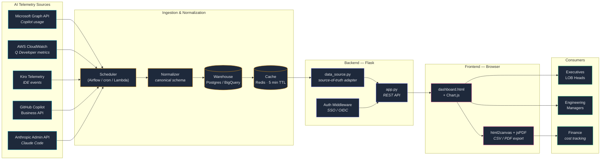
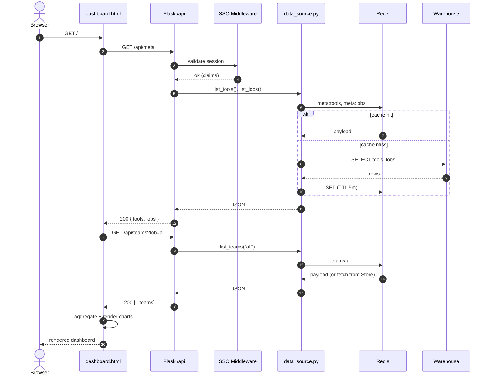
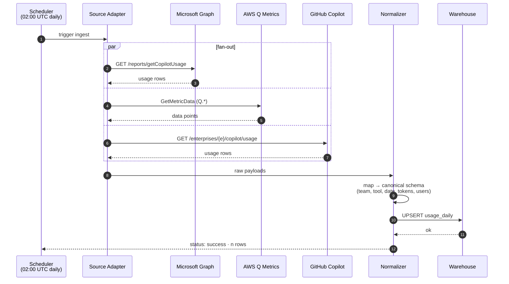
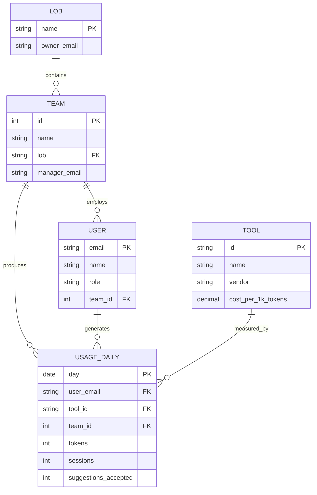
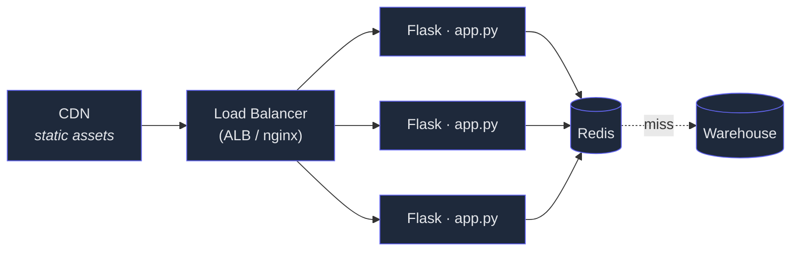

# Enterprise AI Adoption Dashboard — Architecture

Diagrams use [Mermaid](https://mermaid.js.org/). View them by:
- Opening this file on GitHub / GitLab (renders natively)
- VS Code with the *Markdown Preview Mermaid Support* extension
- Pasting any block into <https://mermaid.live>

---

## 1. System overview

---

## 2. Request flow — loading the dashboard

---

## 3. ETL — daily ingestion job

---

## 4. Canonical data model

---

## 5. Component responsibilities

| Layer | Component | Responsibility |
|---|---|---|
| Sources | Vendor APIs | Authoritative usage telemetry per tool |
| ETL | Scheduler | Triggers daily ingestion (Airflow DAG / Lambda + EventBridge / cron) |
| ETL | Normalizer | Maps vendor schemas to canonical `usage_daily` shape |
| Storage | Warehouse | Long-term storage; powers historical queries (Postgres or BigQuery) |
| Storage | Cache | 5-minute TTL Redis layer in front of warehouse — keeps API <100ms |
| Backend | `data_source.py` | Single abstraction over cache + warehouse; the only file that touches storage |
| Backend | `app.py` | Stateless Flask app; thin REST layer that calls `data_source` |
| Backend | Auth | SSO/OIDC middleware (e.g., Authlib, Flask-OIDC) — required for prod |
| Frontend | `dashboard.html` | Renders KPIs, charts, drill-downs from JSON; no business logic |
| Frontend | jsPDF / html2canvas | Client-side export — keeps server stateless |

---

## 6. Where to plug in your real telemetry

In `data_source.py`, replace each function below:

| Function | Today (mock) | Production (suggested) |
|---|---|---|
| `list_tools()` | hard-coded list | static config table or `tools` warehouse table |
| `list_lobs()` | hard-coded list | HRIS export (Workday / SuccessFactors) |
| `list_teams(lob)` | generated | `SELECT ... FROM usage_daily JOIN team ... GROUP BY team, tool, day` against the warehouse, with Redis caching |
| `team_users(team_id, days)` | generated | Same query, group by `user_email` instead of team |
| `export_csv_rows(...)` | iterates teams | Stream rows from a server-side cursor for large orgs |

Keep the **JSON shapes documented in `app.py` route docstrings stable** — the front-end only knows about those, so swapping the backing storage requires zero UI changes.

---

## 7. Scaling & deployment notes

- **Stateless Flask** — scale horizontally; pin sessions to Redis if SSO is sticky.
- **CDN for `dashboard.html` + Chart.js / jsPDF** — they're already CDN-loaded, so the only origin asset is the HTML itself.
- **ETL is async** — dashboard never blocks on ingestion; users always see last-cached snapshot.
- **Cost guardrails** — alert if `kpiCost` projection exceeds budget; surface in dashboard as a banner.
